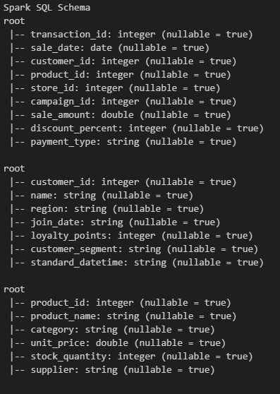
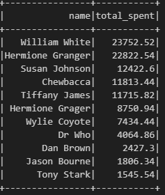
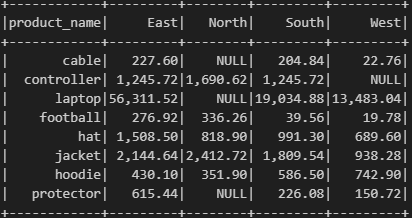
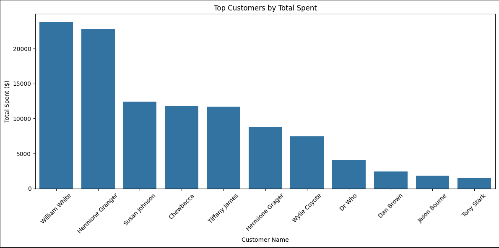
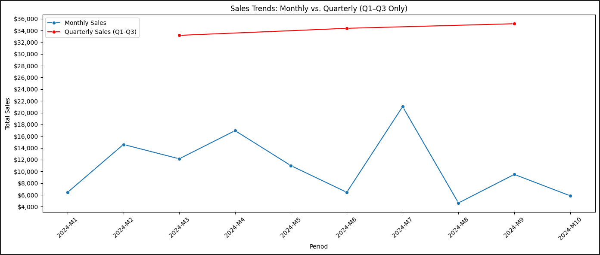

# smart-store-data-git-hub

## Project File Organization

```plaintext
smart-store-data-git-hub
|
|- data/
|   |- _prepared
|       |- customers_data_prepared.csv
|       |- products_data_prepared.csv
|       |- sales_data_prepared.csv
|   |- actual_clean_data
|       |- clean_customer_data.csv
|       |- clean_products_data.csv
|       |- clean_sales_data.csv
|   |- dirty_data
|       |- dirty_customers_data.csv
|       |- dirty_products_data.csv
|       |- dirty_sales_data.csv
|       |- dw
|           |- smart_sales.db
|   |- prepared
|       |- customers_data_prepared.csv
|       |- products_data_prepared.csv
|       |- sales_data_prepared.csv
|   | - processed
|       |- 2024_drilldown.txt
|       |- answers.txt
|       |- P1_B1_Python.txt 
|       |- schema_dimension_table.txt
|       |- schema_fact_table.txt 
|   | - raw
|       |- customers_data.csv
|       |- products_data.csv
|       |- sales_data.csv
|- logs/
|   |- project_log.log
|- scripts/
|   |- data_preparation
|       |- polished_data.py
|       |- prepare_customers_data.py
|       |- prepare_products_data.py
|       |- prepare_sales_data.py
|       |- report_record_differences.py
|   |- __init__.py
|   |- bi_analysis.py
|   |- clean_all_data.py
|   |- create_dirty_data.py
|   |- data_prep_m2.py
|   |- data_prep_m3.py
|   |- data_scrubber.py
|   |- etl_to_dw.py
|   |- schema_dimension_table.py
|   |- schema_fact_table.py
|- tests
|   |-test_data_scrubber,py
|- utils
|   |- utils_logger.py
|- .gitignore
|- LICENSE
|- README.md
|- requirements.txt
|- spark.ipynb
```
### Create a Local Project Virtual Environment

```shell
py -m venv .venv
```

### Activate the Virtual Environment

```shell
.venv\Scripts\activate
```

### Install Packages

```shell
py -m pip install --upgrade -r requirements.txt
```
-----

## Initial Package List

- pip
- loguru
- ipykernel
- jupyterlab
- numpy
- pandas
- matplotlib
- seaborn
- plotly
- pyspark==4.0.0.dev1
- pyspark[sql]

---
## P1. BI Python - Project Script

### On Windows:
```shell
py scripts/bi_analysis.py
```

### On macOS/Linux:
```shell
python3 scripts/bi_analysis.py
```

## P2. BI Python w/External Packages

### On Windows:
```shell
py scripts/data_prep_m2.py
```

### On macOs/Linux:
```shell
python2 scripts/data_prep_m2.py
```

## D3.1 Data Collection

### On Windows:
```shell
py scripts/data_prep_m3.py
```

### On macOS/Linux:
```shell
python3 scripts/data_prep_m3.py
```

## D3.2 Data Cleaning & ETL Prep

### Dirty the Data

### On Windows:
```shell
py scripts\create_dirty_data.py
```

### On macOS/Linux:
```shell
python3 scripts/create_dirty_data.py
```

### Clean the Data

### On Windows:
```shell
py scripts\data_preparation\polished_data.py
```

### On macOS/Linux:
```shell
python3 scripts/data_preparation/polished_data.py
```

### Run Difference Record Report

### On Windows:
```shell
py scripts\data_preparation\report_record_differences.py
```

### On macOS/Linux:
```shell
python3 scripts/data_preparation/report_record_differences.py
```

## P3. Prepare Data for ETL

### Run Test Data Scrubber

### On Windows:
```shell
py tests\test_data_scrubber.py
```

### On macOS/Linux:
```shell
python3 tests\test_data_scrubber.py
```

### Run Actual Scrubber on Datasets

### On Windows:
```shell
py scripts/clean_all_data.py
```

### On macOS/Linux:
```shell
python3 scripts/clean_all_data.py
```

### Run schema_dimension_table.py

### On Windows:
```shell
py scripts/schema_dimension_table.py
```

### On macOS/Linux: 
```shell
python3 scripts/schema_dimension_table.py
```

### Run schema_fact_table.py

### On Windows:
```shell
py scripts/schema_fact_table.py
```

### On macOS/Linux: 
```shell
python3 scripts/schema_fact_table.py
```

## P4. Create and Populate DW

### Run etl_to_dw.py

### On Windows:
```shell
py scripts/etl_to_dw.py
```

### On macOS/Linux:
```shell
python3 scripts/etl_to_dw.py
```


## P5. Cross-Platform Reporting with Spark

1. Describe your SQL queries and reports.
    This project involved designing, implementing, and analyzing a data warehouse using SQLite and PySpark. The dataset consisted of customer, product, and sales records sourced from pre-cleaned CSV files. The goal was to structure the data into a star schema to support business intelligence reporting, extract insights using Spark SQL, and visualize trends and top performers. <br>

2. Explain dashboard design choices.
    I used a star schema in the data warehouse to simplify relationships and optimize read performance. <br>

    Drilldown aggregations provided a way to analyze sales at varying levels of granularity, from yearly summaries to monthly breakdowns. <br>

    By caching the tables in Spark, I improved performance for repeated queries, especially when joining or aggregating large datasets. <br>

3. Include screenshot of: Spark SQL Schema
### Spark SQL Schema



4. Include screenshot of: Query Results

### Query - Total Revenue by Customer



### Matrix - Product Region Matrix



5. Include screenshot of: Final Dashboard / Charts

### Charts - Top Customer Chart



### Charts - Sales Trends 2024


